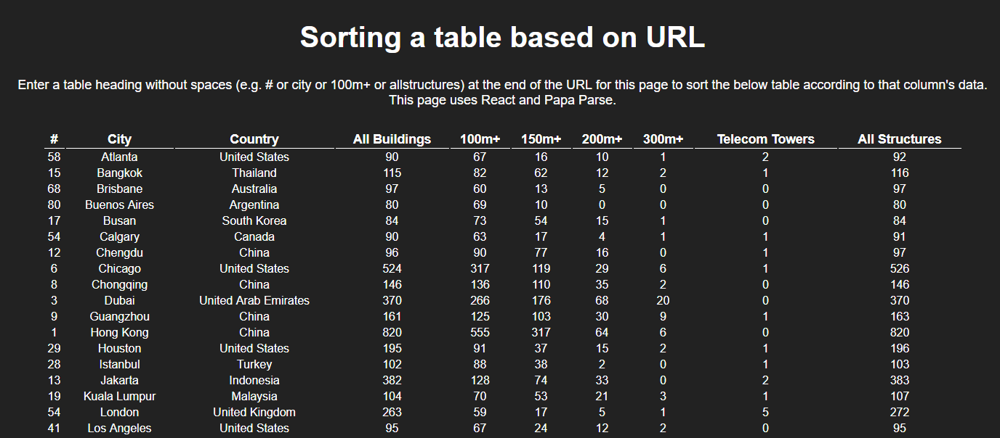

# Table sorting via URL parameter

This project was bootstrapped with [Create React App](https://github.com/facebookincubator/create-react-app).

## Getting Started
using a terminal:

navigate to an empty working directory, clone the project with git clone <insert url here>, then run npm install in parent project directory, then npm start

## Author 
Adam Razzak

## Acknowledgements
see code comments

## Project preview:

